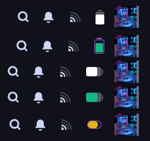

# Mobile Battery Theme

[](https://github.com/NoDataFound/mobile-battery-theme/releases)
[](https://opensource.org/licenses/MIT)
[](https://store.steampowered.com/steamdeck)
[](https://deckthemes.com/)
[](https://deckthemes.com/)

A CSS Loader theme for Steam Deck that replaces the default battery icon with customizable battery indicators inspired by Android, iOS, and macOS designs.

<p align="center">
  
</p>

## Battery Styles

### Android 16 (Filled Background)
```
Vertical:           Horizontal:
   ╭─╮              ╭──────────────╮
 ╭─┴─╮              │ ████████░░░░ ├╮
 │███│              ╰──────────────╯╯
 │███│
 │░░░│
 ╰───╯
```
Semi-transparent filled background with solid fill indicator.

### Android 16 v2 (Outlined)
```
Vertical:           Horizontal:
   ╭─╮              ┌──────────────┐
 ┌─┴─┐              │ ████████░░░░ ├─
 │███│              └──────────────┘
 │███│
 │░░░│
 └───┘
```
Outlined border style with lightning bolt when charging.

### iOS 26
```
Vertical:           Horizontal:
   ╷                ┌──────────────┐
 ┌─┴─┐              │ ████████░░░░ ├╴
 │███│              └──────────────┘
 │███│
 │░░░│
 └───┘
```
iOS-style with separated nub and lightning bolt when charging.

### Additional Styles
- **macOS Horizontal/Vertical** - macOS-inspired design
- **Pill Horizontal/Vertical** - Rounded pill shape
- **Segmented Horizontal/Vertical** - Segmented battery indicator

## Features

- **12 Battery Styles**: Android 16, Android 16 v2, iOS 26, macOS, Pill, and Segmented in both orientations
- **17 Fill Colors**: White, Red, Orange, Amber, Yellow, Lime, Green, Emerald, Teal, Cyan, Sky, Blue, Indigo, Violet, Purple, Magenta, Pink, Rose
- **9 Border Colors**: Separate border color customization
- **Percentage Toggle**: Show or hide battery percentage text
- **Battery Level Display**: Shows current charge with semi-transparent depleted portion
- **State Indicators**: Low battery (orange), critical (red pulse), charging (green with lightning bolt), and full states

## Requirements

- Steam Deck with SteamOS
- [Decky Loader](https://github.com/SteamDeckHomebrew/decky-loader) installed
- [CSS Loader](https://github.com/DeckThemes/SDH-CssLoader) plugin installed

## Installation

### From DeckThemes Store (Recommended)
1. Open Quick Access Menu (... button) in Gaming Mode
2. Navigate to Decky > CSS Loader
3. Go to the Store tab
4. Search for "Mobile Battery Theme"
5. Click Install

### Manual Install

1. Copy the `mobile-battery-theme` folder to:
   ```
   /home/deck/homebrew/themes/
   ```
2. In Gaming Mode, open Quick Access Menu
3. Navigate to Decky > CSS Loader
4. Press "Refresh" at the bottom
5. Enable "Mobile Battery Theme"

## Configuration

After enabling the theme, use the dropdown options in CSS Loader to customize:

| Option | Values | Description |
|--------|--------|-------------|
| Battery Style | Android 16 H/V, Android 16 v2 H/V, iOS 26 H/V, macOS H/V, Pill H/V, Segmented H/V | Battery icon style |
| Fill Color | 17 colors | Color of the battery fill |
| Border Color | 9 colors | Color of the battery outline |
| Show Percentage | Yes, No | Toggle percentage text |

## File Structure

```
mobile-battery-theme/
├── theme.json              # Theme manifest with patches
├── shared.css              # CSS variables and animations
└── styles/
    ├── android16-vertical.css      # Android 16 filled style
    ├── android16-horizontal.css
    ├── android16-v2-vertical.css   # Android 16 outlined style
    ├── android16-v2-horizontal.css
    ├── ios26-vertical.css          # iOS 26 style
    ├── ios26-horizontal.css
    ├── macos-vertical.css          # macOS style
    ├── macos-horizontal.css
    ├── pill-vertical.css           # Pill style
    ├── pill-horizontal.css
    ├── segmented-vertical.css      # Segmented style
    ├── segmented-horizontal.css
    ├── color-*.css                 # Fill color overrides (17 colors)
    ├── border-*.css                # Border color overrides (9 colors)
    ├── show-percentage.css         # Show percentage inside battery
    └── hide-percentage.css         # Hide percentage
```

## Style Comparison

| Style | Background | Border | Nub | Charging Indicator |
|-------|------------|--------|-----|-------------------|
| Android 16 | Filled (30% white) | None | Same as background | Blue pulse |
| Android 16 v2 | Transparent | 1.5px white | White, flush | Lightning bolt |
| iOS 26 | Transparent | 1.5px white | White, with gap | Lightning bolt |
| macOS | Transparent | Border | Small nub | Color change |
| Pill | Filled | Rounded | Rounded | Pulse |
| Segmented | Filled | Segments | Segmented | Pulse |

## Customization

### Creating Custom Colors

Create a new file `styles/color-custom.css`:

```css
:root {
    --mbt-fill-color: #YOUR_HEX !important;
}
```

Then add to `theme.json` under "Fill Color" > "values":

```json
"Custom": { "styles/color-custom.css": ["SP", "QuickAccess", "MainMenu"] }
```

## Troubleshooting

| Issue | Solution |
|-------|----------|
| Theme not appearing | Verify theme.json is valid JSON, refresh CSS Loader |
| Battery unchanged | Check if CSS Loader is enabled and theme is active |
| Colors not applying | Ensure color CSS loads after main style CSS |
| Percentage won't hide | Toggle the option off and refresh |

## License

MIT License - Feel free to modify and redistribute.

## Credits

- [Decky Loader](https://decky.xyz/)
- [DeckThemes/CSS Loader](https://deckthemes.com/)
- Inspired by Android 16, iOS 26, and macOS battery designs
