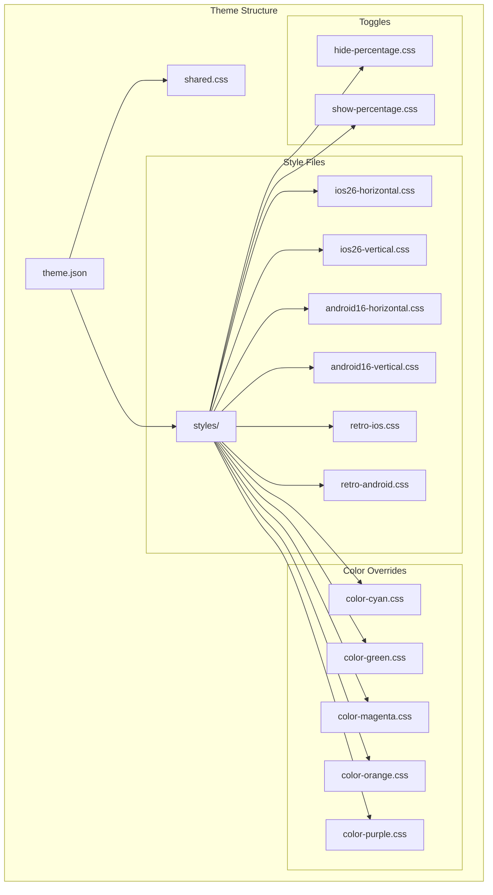
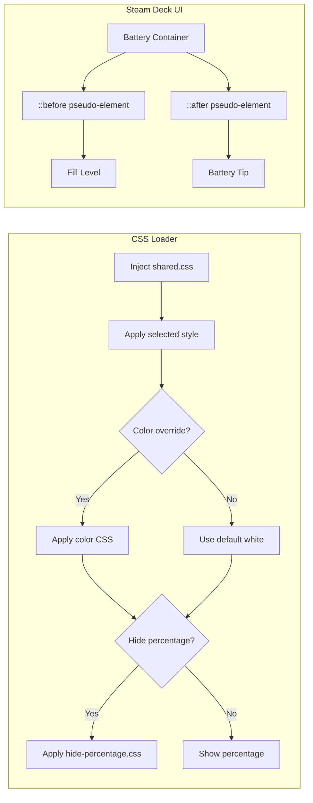
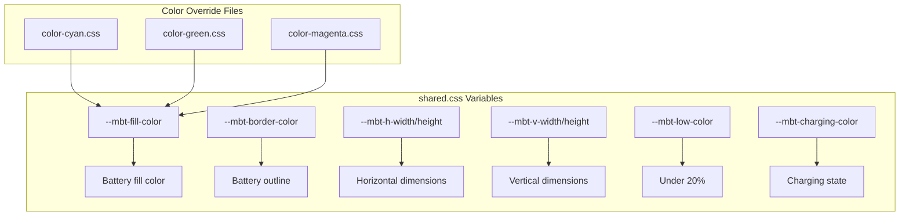
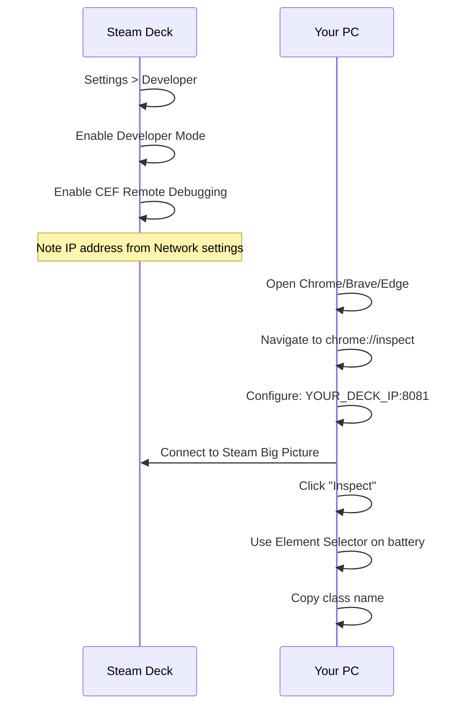
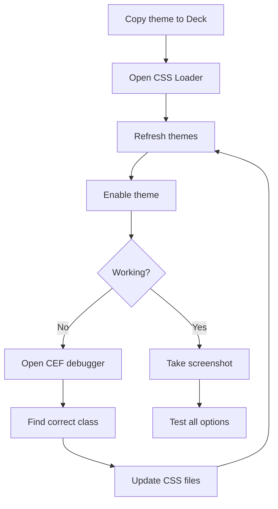

# Mobile Battery Theme

A CSS Loader theme for Steam Deck that replaces the default battery icon with iOS 26, Android 16, and retro-style battery indicators.

```
iOS 26 Horizontal:       iOS 26 Vertical:       Android 16:
╭────────────╮╮             ╭─╮               ╭──────────────╮
│████████    ││           ╭─┴─╮              │ ████████░░░░ ├╮
╰────────────╯╯           │███│              ╰──────────────╯╯
                          │███│
                          ╰───╯

Retro iOS (iOS 6):       Retro Android (Holo):
┌────────────┬─┐         ┌────────────────┐
│▓▓▓▓▓▓▓▓    │█│         │ ████████░░░░░░ ├─
└────────────┴─┘         └────────────────┘
```

## Features

- **6 Battery Styles**:
  - iOS 26 Horizontal & Vertical (modern, refined corners)
  - Android 16 Horizontal & Vertical (Material You pill design)
  - Retro iOS (iOS 6 skeuomorphic with glossy gradients)
  - Retro Android (Holo era with Tron-like glow)

- **6 Color Options**: White, Cyan, Green, Magenta, Orange, Purple

- **Percentage Toggle**: Show or hide battery percentage text

- **State Indicators**: Low battery, critical, charging, and full states

## Architecture



## How It Works



## CSS Variable System



## Requirements

- Steam Deck with SteamOS
- [Decky Loader](https://github.com/SteamDeckHomebrew/decky-loader) installed
- [CSS Loader](https://github.com/DeckThemes/SDH-CssLoader) plugin installed

## Installation

### Option 1: From DeckThemes Store (Recommended)
1. Open Quick Access Menu (... button) in Gaming Mode
2. Navigate to Decky > CSS Loader
3. Go to the Store tab
4. Search for "Mobile Battery Theme"
5. Click Install

### Option 2: Manual Install
1. Copy the `mobile-battery-theme` folder to:
   ```
   /home/deck/homebrew/themes/
   ```
2. In Gaming Mode, open Quick Access Menu
3. Navigate to Decky > CSS Loader
4. Press "Refresh" at the bottom
5. Enable "Mobile Battery Theme"

### Option 3: SSH/SFTP
```bash
scp -r mobile-battery-theme deck@YOUR_DECK_IP:/home/deck/homebrew/themes/
```

## CRITICAL: Finding CSS Class Names

**This theme uses placeholder selectors that you MUST update!**

Steam uses obfuscated CSS class names that change between updates. You need to find the actual class names on your Steam Deck.

### Step 1: Enable CEF Remote Debugging



### Step 2: Update CSS Files

Replace all `[BATTERY_CONTAINER_CLASS]` placeholders:

```css
/* Before */
[BATTERY_CONTAINER_CLASS] svg {
    display: none !important;
}

/* After (example) */
.batteryicon_BatteryIcon_3AqLm svg {
    display: none !important;
}
```

Common class patterns to look for:
- `batteryicon_BatteryIcon_XXXXX`
- `statusbar_Battery_XXXXX`
- `BatteryIconContainer`

## File Structure

```
mobile-battery-theme/
├── theme.json              # Theme manifest with patches
├── shared.css              # CSS variables and animations
├── styles/
│   ├── ios26-horizontal.css
│   ├── ios26-vertical.css
│   ├── android16-horizontal.css
│   ├── android16-vertical.css
│   ├── retro-ios.css
│   ├── retro-android.css
│   ├── color-cyan.css
│   ├── color-green.css
│   ├── color-magenta.css
│   ├── color-orange.css
│   ├── color-purple.css
│   ├── hide-percentage.css
│   └── show-percentage.css
└── README.md
```

## Testing on Steam Deck

### Quick Test Workflow



### Taking Screenshots

1. **In Gaming Mode**: Press Steam + R1 to capture
2. **Via SSH**:
   ```bash
   ssh deck@YOUR_DECK_IP
   DISPLAY=:0 scrot ~/screenshot.png
   ```
3. **Via Decky Screenshot plugin**: Install from store for quick captures

## Customization

### Adjust Dimensions

Edit `shared.css`:
```css
:root {
    --mbt-h-width: 28px;   /* Horizontal width */
    --mbt-h-height: 14px;  /* Horizontal height */
    --mbt-v-width: 14px;   /* Vertical width */
    --mbt-v-height: 28px;  /* Vertical height */
}
```

### Create Custom Color

Create a new file `styles/color-custom.css`:
```css
:root {
    --mbt-fill-color: #YOUR_COLOR !important;
    --mbt-border-color: rgba(R, G, B, 0.9) !important;
    --mbt-ios26-gradient-start: #LIGHTER !important;
    --mbt-ios26-gradient-end: #DARKER !important;
}
```

Then add to `theme.json`:
```json
"Custom Color": {
    "styles/color-custom.css": ["SP", "QuickAccess", "MainMenu"]
}
```

## Known Limitations

### Dynamic Battery Level
The CSS approach shows a static 75% fill. Dynamic fill requires:
- A Decky plugin that reads battery level
- JavaScript to update CSS variables
- Or leveraging Steam's existing inline styles

### Valve Updates
SteamOS updates may:
- Change CSS class names (requires re-finding them)
- Alter battery element structure
- Temporarily break themes

## Troubleshooting

| Issue | Solution |
|-------|----------|
| Theme not appearing | Check `theme.json` is valid JSON, refresh CSS Loader |
| Battery unchanged | Wrong selector - use CEF debugger to find correct class |
| Colors not applying | Ensure color CSS loads after style CSS |
| Percentage won't hide | Find correct percentage class via debugger |

## Contributing

Found the current CSS class names? Please share them in an issue or PR! Class names change with updates, so community documentation helps everyone.

## License

MIT License - Feel free to modify and redistribute.

## Credits

- [Decky Loader](https://decky.xyz/)
- [DeckThemes/CSS Loader](https://deckthemes.com/)
- Inspired by iOS and Android battery designs
